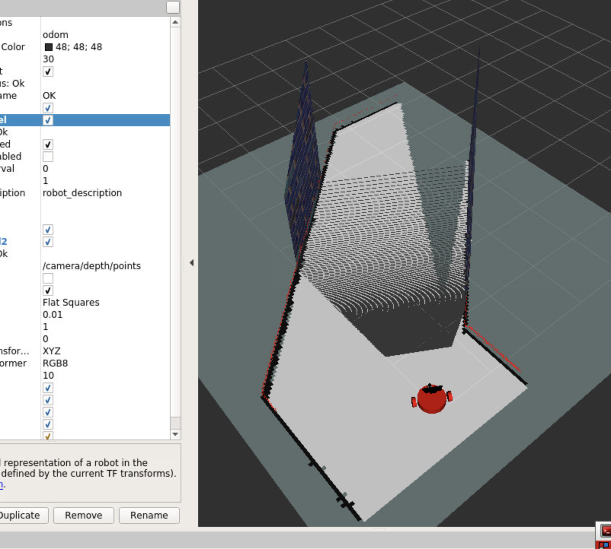
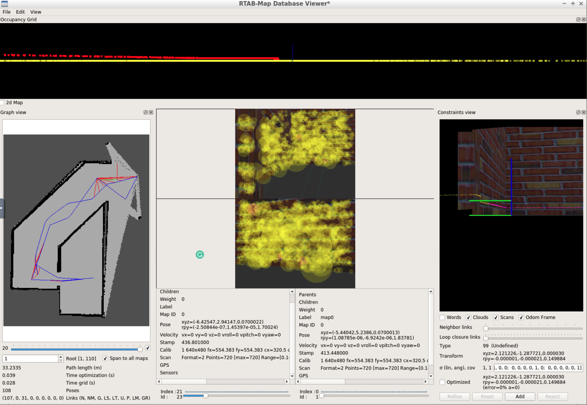
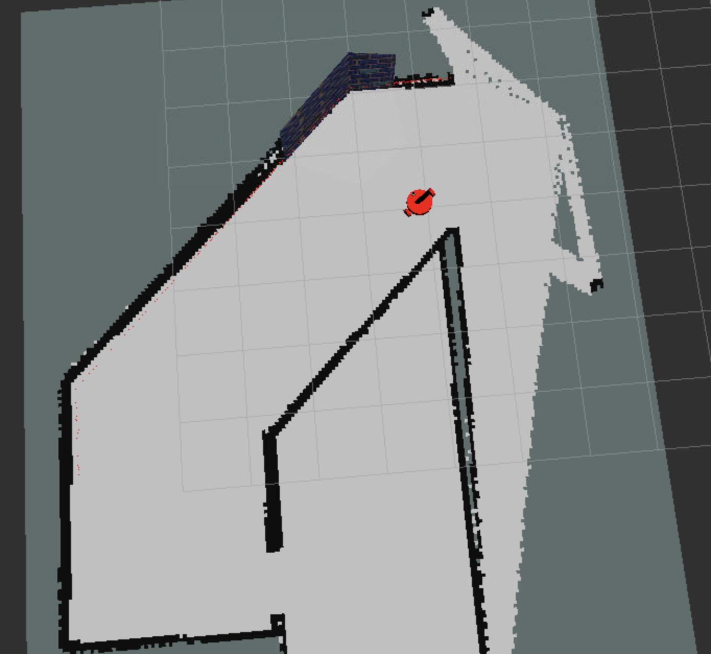

# RoboNd-Map my world
Robotics Engineer Nanodegree Program

---
## Basic Build Instructions
Create catkin workspace

mkdir -p catkin_ws/src

cd catkin_ws/src

catkin_init_workspace

clone this repo

cd ..

catkin_make

source devel/setup.bash

## Basic Instructions
Run world with command:

roslaunch my_robot world.launch

Then run, if you want mapping:

roslaunch my_robot mapping.launch

After mapping data about database can be reviewed with the following command:

rtabmap-databaseViewer ~/.ros/rtabmap.db

Since we have copied the data to the maps folder, you can go to maps folder and run

rtabmap-databaseViewer rtabmap.db

There can be seen that the number of loop closures is 31

If you want localization:

roslaunch my_robot localization.launch

This will also run teleop, that will move robot with these commands.
<pre>Reading from the keyboard  and Publishing to Twist!
---------------------------
Moving around:
   u    i    o
   j    k    l
   m    ,    .

q/z : increase/decrease max speeds by 10%
w/x : increase/decrease only linear speed by 10%
e/c : increase/decrease only angular speed by 10%
anything else : stop

CTRL-C to quit</pre>

However, if you want run teleop in stand alone you have a launch for it:
roslaunch my_robot teleop.launch

